# 🚀 Konecta ERP System CI/CD Pipelines

[](https://github.com/konecta/erp-system/actions)
[](https://github.com/konecta/erp-system/security)
[](https://sonarcloud.io)

> **Enterprise-grade CI/CD pipelines for the Konecta ERP System with comprehensive security scanning, automated testing, and quality assurance.**

## 📋 Table of Contents

- [🎯 Overview](#-overview)
- [🏗️ Pipeline Architecture](#️-pipeline-architecture)
- [🔧 Frontend Pipeline](#-frontend-pipeline)
- [⚙️ Backend Pipeline](#️-backend-pipeline)
- [⚡ Quick Start](#-quick-start)
- [🔐 Configuration](#-configuration)
- [📊 Monitoring & Reports](#-monitoring--reports)
- [🛠️ Troubleshooting](#️-troubleshooting)
- [📈 Metrics & KPIs](#-metrics--kpis)
- [🔮 Roadmap](#-roadmap)
- [📚 Best Practices](#-best-practices)
- [🆘 Support & Maintenance](#-support--maintenance)

## 🎯 Overview

The Konecta ERP System features **two specialized CI/CD pipelines** designed for enterprise-scale development:

| Pipeline | Technology Stack | Purpose | Key Features |
|----------|------------------|---------|--------------|
| **Frontend** | Angular, Node.js, Docker | UI/UX Development | Security scanning, automated testing, containerization |
| **Backend** | Java Spring Boot, .NET, Docker | Microservices Development | Multi-language support, secret scanning, quality gates |

### ✨ Key Benefits

- 🔒 **Enterprise Security**: Multi-layer vulnerability scanning with Trivy, Gitleaks, and SonarQube
- ⚡ **Smart Optimization**: Change detection, intelligent caching, and parallel processing
- 🧪 **Comprehensive Testing**: Unit tests, integration tests, and code coverage analysis
- 🐳 **Container Security**: Docker image scanning and SBOM generation
- 📊 **Quality Assurance**: SonarQube integration with configurable quality gates
- 📈 **Full Observability**: Detailed reporting and monitoring capabilities

## 🏗️ Pipeline Architecture

```mermaid
graph TB
    subgraph "Frontend Pipeline"
        A1[📁 Detect Changes] --> A2[🔍 Dependency Scan]
        A2 --> A3[🏗️ Build & Test]
        A3 --> A4[📊 Code Quality]
        A4 --> A5[🐳 Docker Build & Scan]
    end
    
    subgraph "Backend Pipeline"
        B1[🔐 Secret Scanning] --> B2[📁 Detect Changes]
        B2 --> B3[🔍 Dependency Scan]
        B3 --> B4[🏗️ Build & Test]
        B4 --> B5[📊 Code Quality]
        B5 --> B6[🐳 Docker Build & Scan]
    end
    
    A1 -.->|Path: frontend/**| Trigger[🚀 Trigger Events]
    B1 -.->|Path: backend/**| Trigger
    
    Trigger --> |Push/PR to main/develop| A1
    Trigger --> |Push/PR to main/develop| B1
```



## 🔧 Frontend Pipeline

> **Angular-based UI pipeline with enterprise security and quality standards**

### 📋 Pipeline Summary

| Stage | Duration | Tools | Purpose |
|-------|----------|-------|---------|
| **Change Detection** | ~2 min | Git | Identify modified frontend files |
| **Dependency Scan** | ~5 min | Trivy | Scan npm packages for vulnerabilities |
| **Build & Test** | ~8 min | Angular, npm | Compile and test application |
| **Code Quality** | ~6 min | SonarQube | Static analysis and quality gates |
| **Docker Build** | ~10 min | Docker, Trivy | Containerize and security scan |

### 🔄 Stage Details

#### 1️⃣ **Change Detection**
```yaml
Purpose: Smart pipeline optimization
Trigger: frontend/** file changes
Features:
  ✅ Compares against base branch (PR) or previous commit (push)
  ✅ Skips entire pipeline if no frontend changes detected
  ✅ Optimizes CI/CD execution time
```

#### 2️⃣ **Dependency Vulnerability Scan**
```yaml
Tool: Trivy SCA
Target: package-lock.json, node_modules
Severity: CRITICAL, HIGH
Features:
  ✅ Scans npm dependencies for known vulnerabilities
  ✅ Generates SARIF reports for GitHub Security tab
  ✅ Fails pipeline on critical vulnerabilities
  ✅ Ignores unfixed vulnerabilities
```

#### 3️⃣ **Build & Test**
```yaml
Framework: Angular 17+ with Node.js 18
Features:
  ✅ npm dependency caching for faster builds
  ✅ Conditional linting (if configured)
  ✅ Smart test execution (only if test files exist)
  ✅ Production-optimized Angular build
  ✅ Code coverage collection and reporting
  ✅ Artifact upload for build outputs
```

#### 4️⃣ **Code Quality Analysis**
```yaml
Tool: SonarQube Scanner
Target: TypeScript/Angular source code
Features:
  ✅ Analyzes TypeScript source code
  ✅ Integrates test coverage data
  ✅ Quality gate enforcement
  ✅ Excludes test files and build artifacts
  ✅ Generates comprehensive quality reports
```

#### 5️⃣ **Docker Build & Security Scan**
```yaml
Tools: Docker Buildx, Trivy
Features:
  ✅ Multi-stage Docker build optimization
  ✅ Nginx-based production image
  ✅ Image size monitoring (warns if >500MB)
  ✅ Trivy vulnerability scanning (OS & libraries)
  ✅ SBOM generation in SPDX format
  ✅ SARIF upload to GitHub Security
  ✅ Docker Hub push with versioned tags
  ✅ Automatic 'latest' tag on main branch
```

## ⚙️ Backend Pipeline

> **Multi-language microservices pipeline supporting Java Spring Boot and C# .NET**

### 📋 Pipeline Summary

| Stage | Duration | Tools | Purpose |
|-------|----------|-------|---------|
| **Secret Scanning** | ~3 min | Gitleaks | Detect exposed credentials |
| **Change Detection** | ~2 min | Git | Identify modified services |
| **Dependency Scan** | ~5 min | Trivy | Scan dependencies for vulnerabilities |
| **Build & Test** | ~12 min | Maven/.NET | Compile and test services |
| **Code Quality** | ~8 min | SonarQube | Static analysis and quality gates |
| **Docker Build** | ~15 min | Docker, Trivy | Containerize and security scan |

### 🔄 Stage Details

#### 1️⃣ **Secret Scanning**
```yaml
Tool: Gitleaks v8.18.4
Target: Entire repository history
Features:
  ✅ Scans for exposed API keys, passwords, tokens
  ✅ Generates SARIF reports for GitHub Security
  ✅ Prevents credential leaks before production
  ✅ 30-day retention for audit trails
  ✅ Redacts sensitive information in reports
```

#### 2️⃣ **Change Detection**
```yaml
Purpose: Dynamic service discovery and optimization
Features:
  ✅ Auto-detects Java (Maven) and C# (.NET) services
  ✅ Compares against base branch (PR) or previous commit
  ✅ Generates matrix strategy for parallel processing
  ✅ Skips pipeline if no backend changes detected
  ✅ Supports mixed-language microservices architecture
```

#### 3️⃣ **Dependency Vulnerability Scan**
```yaml
Tool: Trivy SCA
Target: backend/ directory
Severity: CRITICAL, HIGH
Features:
  ✅ Scans Maven and NuGet dependencies
  ✅ Generates SARIF reports for GitHub Security
  ✅ Fails pipeline on critical vulnerabilities
  ✅ Ignores unfixed vulnerabilities
```

#### 4️⃣ **Build & Test**
```yaml
Frameworks: Maven (Java 21) + .NET 8.0
Features:
  Java Services:
    ✅ Java 21 with Temurin distribution
    ✅ Maven dependency caching
    ✅ JUnit test execution with coverage
    ✅ JaCoCo code coverage reports
    ✅ JAR artifact generation
  C# Services:
    ✅ .NET 8.0 with conditional test execution
    ✅ TRX test result generation
    ✅ OpenCover code coverage collection
  ✅ Parallel execution per service
  ✅ Visual test result reporting
```

#### 5️⃣ **Code Quality Analysis**
```yaml
Tool: SonarQube
Target: Java + C# source code
Features:
  Java Analysis:
    ✅ Maven SonarQube plugin integration
    ✅ JaCoCo coverage data integration
    ✅ Quality gate enforcement
  C# Analysis:
    ✅ .NET SonarQube Scanner
    ✅ OpenCover coverage integration
    ✅ Quality gate enforcement
  ✅ Service-specific project keys
  ✅ Historical trend tracking
```

#### 6️⃣ **Docker Build & Security Scan**
```yaml
Tools: Docker Buildx, Trivy
Features:
  ✅ Service-specific Dockerfile selection
  ✅ Multi-platform build support
  ✅ Smart tagging (branch-SHA or semver)
  ✅ Image size monitoring (warns if >1GB)
  ✅ Smoke tests before security scanning
  ✅ Trivy vulnerability scanning (OS & libraries)
  ✅ SBOM generation in SPDX format
  ✅ SARIF upload to GitHub Security
  ✅ Docker Hub push with versioned tags
  ✅ Automatic 'latest' tag on main branch
```

## ⚡ Quick Start

### 🚀 Getting Started

1. **Clone the repository**
   ```bash
   git clone https://github.com/konecta/erp-system.git
   cd erp-system
   ```

2. **Configure secrets** (see [Configuration](#-configuration) section)

3. **Make changes** to frontend or backend code

4. **Push to trigger pipelines**
   ```bash
   git push origin develop
   ```

5. **Monitor progress** in GitHub Actions tab

### 📁 Repository Structure

```
Konecta-ERP-System/
├── frontend/
│   └── erp-ui/                    # Angular application
│       ├── src/                   # Source code
│       ├── package.json           # Dependencies
│       ├── Dockerfile             # Container config
│       └── nginx.conf             # Web server config
├── backend/
│   ├── auth-service/              # Java Spring Boot
│   │   ├── pom.xml               # Maven config
│   │   ├── Dockerfile            # Container config
│   │   └── src/                  # Source code
│   ├── hr-service/                # Java Spring Boot
│   ├── reporting-service/         # C# .NET
│   │   └── ReportingService/
│   │       ├── ReportingService.csproj
│   │       ├── Dockerfile
│   │       └── Controllers/
│   └── ...                       # Other microservices
├── .github/
│   └── workflows/
│       ├── frontend-ci.yml       # Frontend pipeline
│       ├── backend-ci.yml        # Backend pipeline
│       └── README.md             # This documentation
└── docker-compose.yml            # Local development
```

## 🔐 Configuration

### 🔑 Required Secrets

Configure these in your GitHub repository settings (`Settings > Secrets and variables > Actions`):

| Secret | Description | Example | Required For |
|--------|-------------|---------|--------------|
| `DOCKER_USERNAME` | Docker Hub username | `your-dockerhub-user` | Both Pipelines |
| `DOCKER_PASSWORD` | Docker Hub access token | `dckr_pat_xxxxx` | Both Pipelines |
| `SONAR_TOKEN` | SonarQube authentication token | `squ_xxxxx` | Both Pipelines |
| `SONAR_URL` | SonarQube server URL | `https://sonar.example.com` | Both Pipelines |

### ⚙️ Environment Variables

| Variable | Default | Description | Pipeline |
|----------|---------|-------------|----------|
| `JAVA_VERSION` | `21` | Java SDK version for backend services | Backend |
| `NODE_VERSION` | `18` | Node.js version for frontend | Frontend |

### 🎯 Trigger Conditions

| Event | Frontend | Backend | Description |
|-------|----------|---------|-------------|
| **Push** | `frontend/**` changes | `backend/**` changes | Automatic trigger on code changes |
| **Pull Request** | `frontend/**` changes | `backend/**` changes | Quality checks before merge |
| **Manual Dispatch** | ✅ | ✅ | Manual trigger via GitHub UI |

### 🏗️ Matrix Strategy

#### Frontend Pipeline
- **Single Job**: Processes entire frontend application
- **Conditional Execution**: Skips if no frontend changes detected

#### Backend Pipeline
- **Dynamic Matrix**: Automatically detects changed services
- **Parallel Processing**: Each service builds independently
- **Service Types**: Supports both Java (Maven) and C# (.NET) services

## 📊 Monitoring & Reports

### 🔍 GitHub Integration

| Feature | Description | Location |
|---------|-------------|----------|
| **Security Tab** | All SARIF reports automatically uploaded | Repository > Security |
| **Actions Tab** | Visual workflow execution and logs | Repository > Actions |
| **Artifacts** | Downloadable reports and build outputs | Workflow run > Artifacts |

### 📈 Generated Artifacts

#### Security Reports (30-90 day retention)
- **Gitleaks SARIF**: Secret scanning results (Backend only)
- **Trivy SARIF**: Dependency and container vulnerability reports
- **SBOM Files**: Software Bill of Materials in SPDX format (90-day retention)

#### Build Artifacts (7-day retention)
- **Frontend**:
  - Angular build output (`dist/` directory)
  - Test results and coverage reports
- **Backend**:
  - JAR files (Java services)
  - .NET build artifacts (C# services)
  - Test results (JUnit XML, TRX files)
  - Code coverage reports (JaCoCo, OpenCover)

#### Docker Images
- **Format**: `{username}/konecta-{component}:{version}`
- **Versioning**: `{branch}-{short-sha}` or `{tag}` for releases
- **Latest**: Automatically tagged on main branch pushes

### 🎯 Quality Gates

#### Security Scanning
- ❌ **FAIL**: Critical vulnerabilities detected
- ⚠️ **WARN**: High-severity vulnerabilities (varies by tool)

#### Docker Security
- ❌ **FAIL**: Critical vulnerabilities in container image
- ⚠️ **WARN**: 
  - Frontend: Image size > 500MB
  - Backend: Image size > 1GB

#### Code Quality
- ❌ **FAIL**: SonarQube quality gate not met

#### Testing
- ❌ **FAIL**: Any unit or integration test fails
- ✅ **PASS**: All tests pass or no tests exist

### ⚡ Optimization Features

#### 1. Smart Caching
- **Maven**: Dependencies cached by POM hash
- **npm**: Package cache for faster installs
- **Docker**: Layer caching using registry
- **Trivy**: Vulnerability database caching

#### 2. Selective Execution
- **Change Detection**: Only processes modified components
- **Conditional Steps**: Skips unnecessary operations
- **Path Filtering**: Triggers only on relevant file changes

#### 3. Parallel Processing
- **Backend**: Multiple services build simultaneously
- **Independent Scans**: Each service scanned separately
- **Matrix Strategy**: Optimized resource utilization

#### 4. Timeout Protection
| Stage | Frontend | Backend | Description |
|-------|----------|---------|-------------|
| Change Detection | 5 min | 5 min | File change analysis |
| Dependency Scan | 15 min | 15 min | Vulnerability scanning |
| Build & Test | 20 min | 20 min | Compilation and testing |
| Docker Build | 25 min | 25 min | Containerization and scanning |

## 🛠️ Troubleshooting

### 🚨 Common Issues

#### Pipeline Fails on Secret Scan (Backend)
```yaml
Cause: Exposed credentials in code
Solution:
  ✅ Review Gitleaks report in artifacts
  ✅ Remove or rotate exposed credentials
  ✅ Add false positives to .gitleaksignore
```

#### Dependency Scan Timeout
```yaml
Cause: Large dependency tree or network issues
Solution:
  ✅ Check internet connectivity
  ✅ Consider increasing timeout
  ✅ Review dependency count
```

#### Docker Push Fails
```yaml
Cause: Authentication or rate limit issues
Solution:
  ✅ Verify Docker Hub credentials
  ✅ Check Docker Hub rate limits
  ✅ Ensure repository exists
```

#### SonarQube Quality Gate Fails
```yaml
Cause: Code quality issues or coverage below threshold
Solution:
  ✅ Review issues in SonarQube dashboard
  ✅ Fix code smells, bugs, and security hotspots
  ✅ Improve test coverage
  ✅ Adjust quality gate settings if needed
```

#### Build Failures
```yaml
Java Services:
  ✅ Check Maven dependencies
  ✅ Verify Java version compatibility
  ✅ Review test failures in logs

C# Services:
  ✅ Check .NET version compatibility
  ✅ Verify NuGet package references
  ✅ Review build configuration

Frontend:
  ✅ Check Node.js version compatibility
  ✅ Verify npm dependencies
  ✅ Review Angular build configuration
```

### 🔍 Debugging Steps
1. **Check Logs**: Review GitHub Actions logs for specific errors
2. **Download Artifacts**: Examine build outputs and test results
3. **Local Testing**: Reproduce issues in local environment
4. **Incremental Fixes**: Address one issue at a time

## 📈 Metrics & KPIs

### 📊 Pipeline Health
- **Execution Time**: Average time per stage and overall
- **Success Rate**: Percentage of successful pipeline runs
- **Failure Rate**: Most common failure points
- **Resource Usage**: CPU, memory, and storage utilization

### 🔒 Security Metrics
- **Vulnerability Detection**: Number of issues found per scan
- **Time to Fix**: Average time to resolve security issues
- **Coverage**: Percentage of code covered by security scans

### 🎯 Quality Metrics
- **Code Coverage**: Test coverage percentage
- **Quality Gate**: SonarQube quality gate pass rate
- **Technical Debt**: Code quality trends over time

## 🔮 Roadmap

### 🚀 Planned Features
- [ ] **Integration Testing**: Add Testcontainers for service integration tests
- [ ] **Performance Testing**: Include load and stress testing stages
- [ ] **Chaos Engineering**: Add failure injection testing
- [ ] **Progressive Deployment**: Implement blue-green or canary deployments
- [ ] **Kubernetes Deployment**: Add K8s deployment automation
- [ ] **Monitoring Integration**: Add application performance monitoring
- [ ] **Automated Rollback**: Implement rollback on quality gate failure
- [ ] **Multi-Environment**: Support for staging and production environments

### 🔐 Security Enhancements
- [ ] **SAST Integration**: Add static application security testing
- [ ] **DAST Integration**: Add dynamic application security testing
- [ ] **License Compliance**: Add license scanning and compliance checks
- [ ] **Secrets Rotation**: Implement automated secret rotation

## 📚 Best Practices

### 💻 Development
1. **Commit Messages**: Use clear, descriptive messages for better change tracking
2. **Branch Strategy**: Use feature branches with descriptive names
3. **Code Quality**: Maintain high test coverage and code standards
4. **Dependencies**: Regularly update to avoid security vulnerabilities

### 🔒 Security
1. **Secret Management**: Never commit secrets to repository
2. **Dependency Updates**: Keep all dependencies current
3. **Image Security**: Use minimal base images and scan regularly
4. **Access Control**: Limit Docker Hub and SonarQube access

### ⚡ Performance
1. **Build Optimization**: Use multi-stage Docker builds
2. **Caching**: Leverage GitHub Actions caching features
3. **Parallel Execution**: Design services for independent builds
4. **Resource Management**: Monitor and optimize build times

## 🆘 Support & Maintenance

### 🆘 Getting Help
1. **Documentation**: Review this README and inline comments
2. **Logs**: Check GitHub Actions logs for detailed error information
3. **Artifacts**: Download and examine generated reports
4. **Issues**: Create GitHub issues for bugs or feature requests

### 🔧 Maintenance Tasks
- **Weekly**: Review security scan results and address critical issues
- **Monthly**: Update dependencies and base images
- **Quarterly**: Review and update quality gate thresholds
- **Annually**: Evaluate and update pipeline tools and versions

---

<div align="center">

**🚀 Konecta ERP System CI/CD Pipelines**

*Enterprise-grade automation for modern development*

**Version**: 2.0 | **Last Updated**: December 2024 | **Maintainer**: DevOps Team

[](https://github.com/konecta/erp-system/actions)
[](https://github.com/konecta/erp-system/security)
[](https://sonarcloud.io)

</div>
